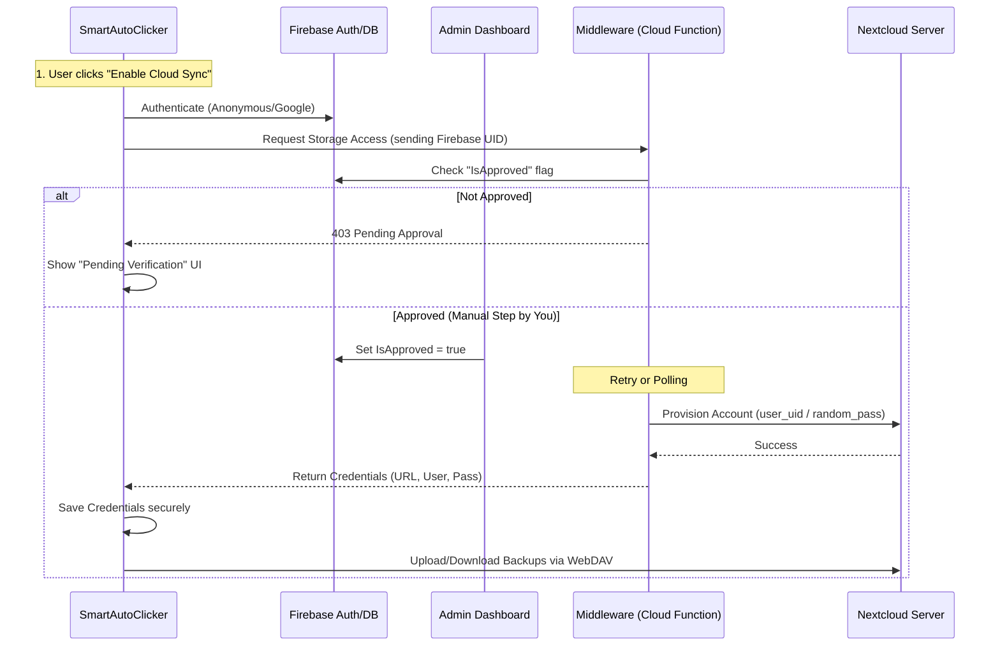

# Nextcloud Integration & Managed Storage Proposal

## 1. Overview
This document outlines the strategy to replace or augment Google Drive with Nextcloud for scenario backups. It focuses on a "Managed/Zero-Config" approach where the user does not need to know technical details (Server URL, Login) to use the feature.

## 2. Integration Approaches

### Option A: Storage Access Framework (The "Easy" Way)
*   **Mechanism:** Use Android's standard `Intent.ACTION_CREATE_DOCUMENT`.
*   **Pros:** Zero custom networking code. Secure. Works with Nextcloud, Google Drive, OneDrive, etc., automatically.
*   **Cons:** Requires the user to have the Nextcloud App installed and logged in on their phone. Requires user interaction to pick the folder.

### Option B: Native WebDAV (The "Managed" Way)
*   **Mechanism:** The app includes a WebDAV client (e.g., using `OkHttp`) to talk directly to a Nextcloud server.
*   **Pros:** Full control over the UI. Can be automated (background sync).
*   **Cons:** Requires handling authentication and server URLs.

## 3. The "Zero-Input" Architecture (Firebase Bridge)

To achieve a flow where the user enters nothing, we must provision credentials for them. We can use Firebase as the Identity Provider (IdP) and bridge it to Nextcloud.

### Architecture Diagram

### Implementation Steps

#### Phase 1: Firebase Setup
1.  Enable **Firebase Authentication** (Anonymous is easiest for zero-input).
2.  Create a **Firestore Database** collection `cloud_users`.
3.  Fields: `uid`, `status` (pending/active), `nextcloud_username`, `created_at`.

#### Phase 2: The Middleware (Node.js/Python Cloud Function)
We cannot store the Nextcloud Admin Username/Password inside the Android App. We need a secure middle layer.

*   **Endpoint:** `provisionNextcloudAccount(firebaseToken)`
*   **Logic:**
    1.  Verify Firebase Token.
    2.  Check Firestore: Is user approved?
    3.  If yes:
        *   Call Nextcloud Provisioning API (`POST /ocs/v2.php/cloud/users`).
        *   Create a sub-user named `klickr_<firebase_uid>`.
        *   Generate an App Password for this user.
        *   Set quota (e.g., 50MB).
    4.  Return the credentials to the Android App.

#### Phase 3: Android Client
1.  **Dependencies:** Add `OkHttp` and a simpler XML parser (for WebDAV).
2.  **Logic:**
    *   On "Enable Cloud": Sign in to Firebase.
    *   Check status. If "Pending", show a waiting screen.
    *   If "Active", receive credentials.
    *   Store credentials in `EncryptedSharedPreferences`.
    *   Use WebDAV PUT/GET to sync `.zip` backups to the specific Nextcloud URL.

## 4. How Nextcloud Identifies the App
Since we are using specific credentials created *for* the app, identification is implicit. However, for logging and security:

1.  **User-Agent:** The app must send a header on every request:
    `User-Agent: SmartAutoClicker/3.4.0 (Android; com.buzbuz.smartautoclicker)`
    *   Nextcloud admins can see this in the access logs.

2.  **App Passwords:** The Middleware should generate a specific "App Password" named "SmartAutoClicker" via the Nextcloud API, rather than using the main account password. This allows revocation without deleting the account.

## 5. Pros & Cons of this Approach

| Feature | Benefit | Drawback |
| :--- | :--- | :--- |
| **Security** | High. App doesn't store master secrets. | Requires maintaining a Middleware (Cloud Function). |
| **User Exp** | Excellent. One click, no typing. | User must wait for manual approval (unless automated). |
| **Control** | You control the storage server and quotas. | You pay for the storage/hosting costs. |
| **Privacy** | User data is isolated. | You are responsible for hosting user data (GDPR implications). |

## 6. Alternative: Shared Folder (Simpler)
Instead of creating a *User* for every app install, create one **Master User** (e.g., `klickr_uploads`) on Nextcloud.
1.  Middleware generates a unique **Public Share Link** (File Drop) for upload.
2.  **Problem:** This is usually "Write Only" (Upload). Downloading specific previous backups is hard without full account access.
3.  **Verdict:** The "Provisioning User" method (Phase 2) is superior for Backup & Restore.
